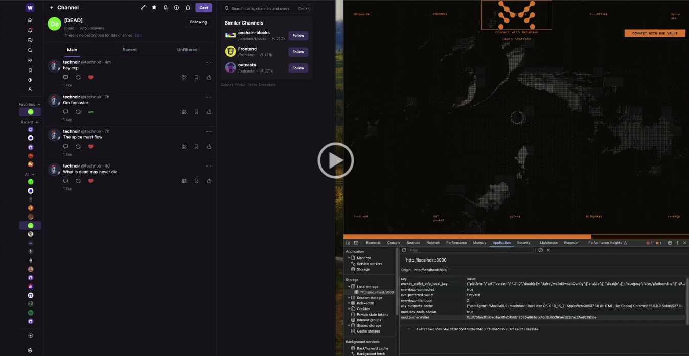

## Alliance Channels - Alliance recruitment and acquisition through Farcaster channels

[](https://drive.google.com/file/d/1CbWx0xnZsNqqimkkgv1jT62davNxzU9b/view?usp=drive_link)


### Why
Farcaster is a permissionless, crypto-native, sufficiently decentralized social network that allows anyone to create custom clients that interact with an onchain social graph. Any onchain game or autonomous world can effectively become a Farcaster client, and thus seamlessly tap into a large pool of (crypto-savvy) users. This aids discoverability and distribution for the developers, whilst in a game like Eve, allows alliances to recruit new players or spread propaganda.

In order to access the dapp interface the user must hold a specific token in their Eve Vault (e.g. an Alliance token). If this is missing they will not be able to progress to signer creation (see below).
This dapp uses a custom Farcaster signer flow which allows players to authorize a signer on OP mainnet via the Warpcast app on their phone. This gives the dapp permission to post on their behalf.
Upon successful creation of a signer, the user's Farcaster ID (FID) is linked with their Eve Vault address in an onchain MUD registry.
The dapp currently only connects to a single moderated channel. The moderator bot periodically polls this channel for new casts and looks up the caster’s FID in the onchain registry. If a match is found the bot will like the post, allowing it to be seen in the main channel feed.
What this effectively means is that users are only able to post in the main channel feed if they have first signed in through the SSU interface. If a user comes direct to the channel without first visiting the SSU, they will not be able to post in the main feed.

### Stack
React/Vite frontend
Farcaster communication facilitated through Neynar APIs
Farcaster moderator bot running on embedded expressJS server
Onchain registry built with MUD

### How to run locally
From root directory run
```
pnpm install
```
Then 
```
pnpm run dev
```
View the live app at ```http://localhost:3000```

### Ideas for future iterations:
- Allow channels to be created directly through the dapp
- Allow images to be posted through the dapp - seize the memes of production
- Allow users to mint NFTs on OP mainnet directly via the dapp - opens the door to granular onchain permissions and other interesting interoperability features